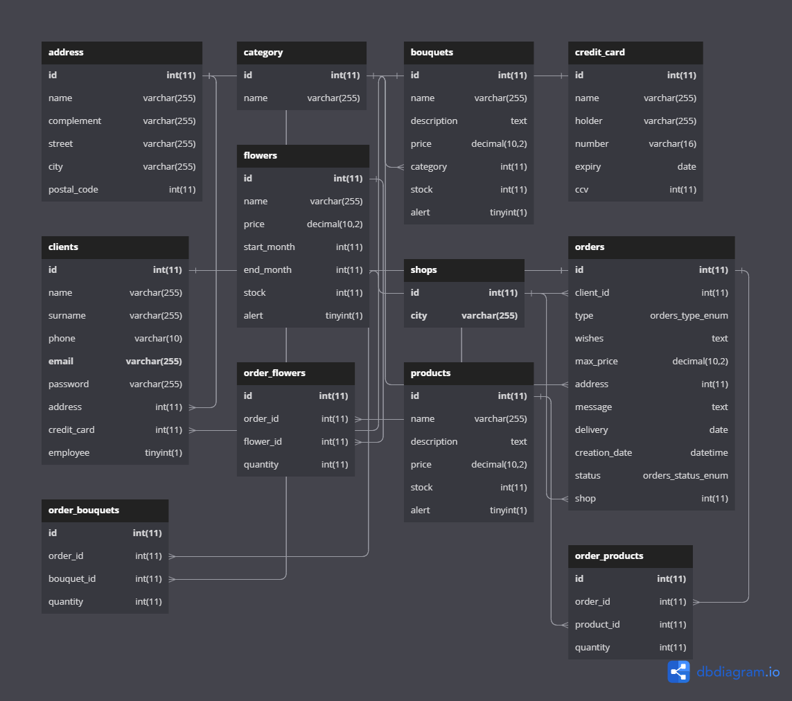

# Le pouvoir des fleurs
#### ESILV A3 S6 (promo 2025)

Dans le cadre de notre projet de fin d'année en cours de base de données et interopérabilité, vous trouverez notre projet C# incluant notre solution répondant au cahier des charges disponible [ici](https://github.com/eliasto/projet-bdd-s6/blob/main/Fleurs.pdf).
 
## Base de données

Pour installer ce projet, vous devez avoir MySQL installé, et créer votre base de données avec le fichier `BelleFleur.sql`. Vous pouvez peupler cette base avec le fichier `Population.sql`.
## Auteurs

- [Elias TOURNEUX](https://www.github.com/eliasto)
- [Marc VIALLARD](https://www.github.com/Marc94440)

## Documentation

 - [Rapport final sur le projet](https://github.com/eliasto/projet-bdd-s6/blob/main/RAPPORT_BDD_TOURNEUX_VIALLARD.pdf)
